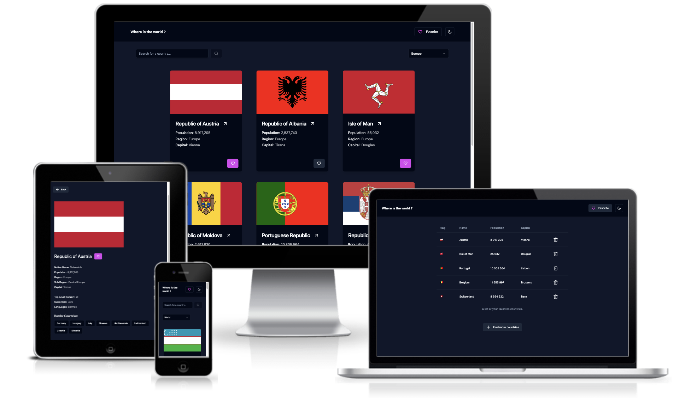

# Countries API REST

Web app to explore all countries provided by the RestCountries API.
Filter, search, and bookmark favorites for later exploration. Dive deeper into any country's details with a simple click on it.

## Demo

🌱 > [Countries API REST live demo](https://coutries-api-rest.vercel.app)

## Preview

## Technologies used:

- React
- Typescript
- Redux Toolkit
- Tailwind
- shadcn/ui
- React-Query
- React-Router
- API: restcountries
- GIT
- Github
- Vite
- Vercel
- Vitest

## Authors

- [@maxdnc](https://github.com/maxdnc)
